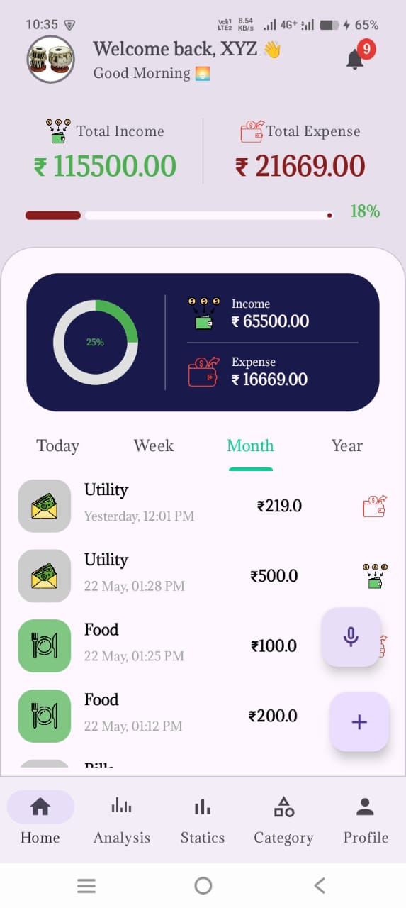
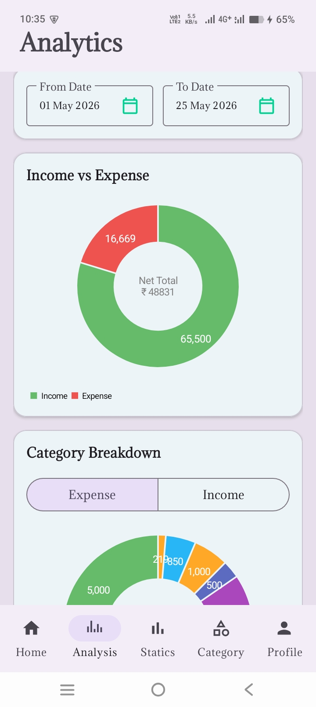
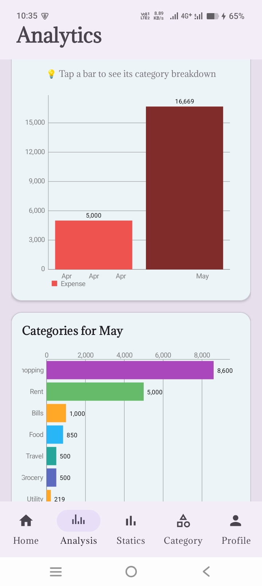
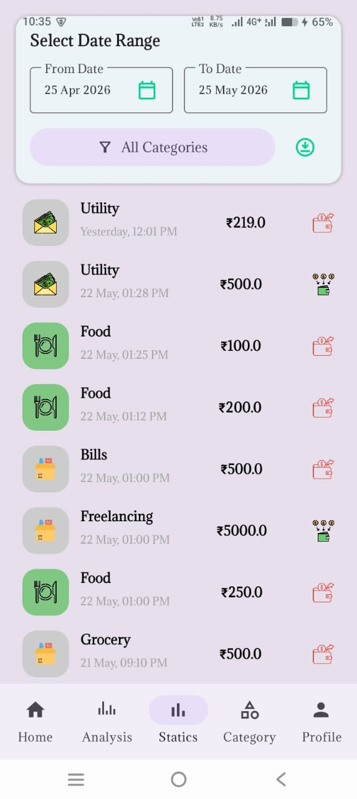

# FinTechVar - Smart Personal Finance Manager

## 🚀 Overview
A comprehensive, automated personal finance application built to track, analyze, and manage daily expenses and income. This project was developed independently to solve real-world transaction management problems, featuring advanced data visualization, natural language voice commands, and automated SMS receipt parsing.

## ✨ Key Features

### 💰 Core Transaction Management
* **Complete CRUD Operations:** Easily add, edit, and delete transaction records.
* **Custom Categories:** Add, edit, or delete personal income and expense categories.
* **Flexible Time Views:** View transaction history grouped by daily, weekly, monthly, and yearly timeframes.
* **Advanced Filtering:** Filter transaction records by specific date ranges and categories.
* **Excel Export:** Download categorized transaction records directly to an Excel file for external use.

### 📊 Interactive Analytics & Visualization
* **Income vs. Expense Dashboard:** A dynamic pie chart breaking down overall financial health.
* **Interactive Drill-Downs:** Clicking a pie chart segment opens a detailed Bottom Sheet.
* **Trend Analysis:** The Bottom Sheet displays a bar chart visualizing specific income/expense trends over time.
* **Global Date Filters:** All charts and analytics views update dynamically based on the selected date range.

### 🤖 Automation & Intelligence
* **Voice Command Integration:** Add transactions hands-free using natural language processing (e.g., "Khane me 200 rupaye kharch hue").
* **Automated SMS Parsing:** Automatically detects and logs transactions by reading and extracting data from incoming bank/payment SMS notifications.

## 🛠 Tech Stack
* **Platform:** Android Studio
* **Language:** Kotlin 
* **Database:** Room
* **Libraries Used:** MPAndroidChart for charts

## 📸 Screenshots
<table>
  <tr>
    <td align="center"> Dashboard</td>
    <td align="center"> Analytics 1</td>
    <td align="center"> Analytics 2</td>
    <td align="center"> History</td>
  </tr>
</table>
[🎥 Click here to watch the App Demo on YouTube]((https://youtube.com/shorts/QD1CK-pDQf8?si=V7IOazSicUd3X2SH))

## 💻 Installation and Setup

   git clone this Repository
  

Launch Android Studio.

Select File > Open and choose the cloned project folder.

Sync Dependencies:

Wait for Android Studio to automatically sync the Gradle files.

Run the app:

Connect a physical Android device or start an emulator.

Click the green Run button or press Shift + F10.

🔐 Permissions Required
Microphone: Required for voice command transaction addition.

Read SMS: Required to securely parse bank notifications for automatic logging (processing is done entirely on-device).

Storage / Media: Required to generate and save exported Excel files.
